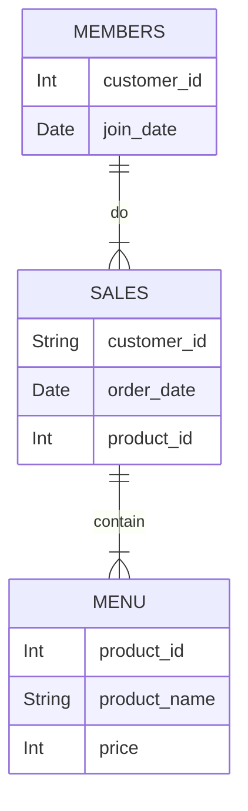

# CASE STUDY #1 - DANNY'S DINER
## General information
**Case study source:** [Case Study #1 - Danny's Diner](https://8weeksqlchallenge.com/case-study-1/)

**Dataset:** [Here](https://github.com/bokw/8_week_SQL_challenge/blob/main/Case%20study%20%231%20-%20Danny's%20Diner/CS1_data.sql) you can find script with dataset and table creation process using SQLite.

**Problem:** Danny wants to use the data to answer a few simple questions about his customers, especially about their visiting patterns, how much money they’ve spent and also which menu items are their favourite. Having this deeper connection with his customers will help him deliver a better and more personalised experience for his loyal customers.

**Entity relationship diagram:**


## Questions and Solutions
### 1. What is the total amount each customer spent at the restaurant?
```SQL
SELECT
	sales.customer_id
	,SUM(menu.price) AS total_amount_spent
FROM CS1_sales sales
LEFT JOIN CS1_menu menu
ON menu.product_id = sales.product_id 
GROUP BY
	sales.customer_id;
```
#### Output
|customer_id|total_amount_spent|
|-----------|------------------|
|A          |                76|
|B          |                74|
|C          |                36|

### 2. How many days has each customer visited the restaurant?
```SQL
SELECT 
	sales.customer_id 
	,COUNT(DISTINCT sales.order_date) AS visit_count
FROM CS1_sales sales
GROUP BY
	sales.customer_id;
```
#### Output
|customer_id|visit_count|
|-----------|-----------|
|A          |          4|
|B          |          6|
|C          |          2|

### 3. What was the first item from the menu purchased by each customer?
```SQL
SELECT
	unique_order.customer_id
	,GROUP_CONCAT(unique_order.product_name, ', ') as first_order
FROM
	(SELECT DISTINCT 
		sales.customer_id 
		,menu.product_name
	FROM CS1_sales sales
	INNER JOIN 
		(SELECT
			sales.customer_id 
			,MIN(sales.order_date) AS first_visit
		FROM CS1_sales sales
		GROUP BY
			sales.customer_id
		) first_visit
	ON first_visit.customer_id = sales.customer_id 
	AND first_visit.first_visit = sales.order_date 
	LEFT JOIN CS1_menu menu
	ON menu.product_id = sales.product_id) unique_order
GROUP BY 
	unique_order.customer_id;
```
#### Output
|customer_id|first_order |
|-----------|------------|
|A          |sushi, curry|
|B          |curry       |
|C          |ramen       |

### 4. What is the most purchased item on the menu and how many times was it purchased by all customers?
```SQL
SELECT 
	menu.product_name  
	,COUNT(sales.customer_id) AS popular_order
FROM CS1_sales sales
LEFT JOIN CS1_menu menu
ON menu.product_id = sales.product_id 
GROUP BY
	menu.product_name  
ORDER BY 
	popular_order DESC
LIMIT 1;
```
#### Output
|product_name|popular_order|
|------------|-------------|
|ramen       |            8|

### 5. Which item was the most popular for each customer?
```SQL
WITH order_ranking AS (
	SELECT 
		sales.customer_id 
		,menu.product_name
		,COUNT(sales.order_date) AS order_count
		,DENSE_RANK() OVER (PARTITION BY sales.customer_id ORDER BY COUNT(sales.order_date) DESC) AS ranking
	FROM CS1_sales sales
	LEFT JOIN CS1_menu menu 
	ON menu.product_id = sales.product_id 
	GROUP BY
		sales.customer_id 
		,menu.product_name
	ORDER BY 
		ranking ASC
)

SELECT 
	ranking.customer_id
	,GROUP_CONCAT(ranking.product_name, ', ') AS most_popular_orders
	,ranking.order_count
FROM order_ranking ranking
WHERE ranking.ranking = 1
GROUP BY 
	ranking.customer_id
	,ranking.order_count;
```
#### Output
|customer_id|most_popular_orders|order_count|
|-----------|-------------------|-----------|
|A          |ramen              |          3|
|B          |sushi, ramen, curry|          2|
|C          |ramen              |          3|

### 6. Which item was purchased first by the customer after they became a member?
```SQL
WITH first_member_order AS (
	SELECT 
		sales.customer_id 
		,menu.product_name
		,sales.order_date
		,DENSE_RANK() OVER (PARTITION BY sales.customer_id ORDER BY sales.order_date ASC) AS ranking
	FROM CS1_sales sales
	INNER JOIN CS1_members members
	ON members.customer_id = sales.customer_id 
	AND members.join_date < sales.order_date 
	LEFT JOIN CS1_menu menu 
	ON menu.product_id = sales.product_id 
	GROUP BY 
		sales.customer_id 
		,menu.product_name 
		,sales.order_date 
)

SELECT 
	customer_id
	,product_name
FROM first_member_order 
WHERE ranking = 1;
```
#### Output
|customer_id|product_name|
|-----------|------------|
|A          |ramen       |
|B          |sushi       |

### 7. Which item was purchased just before the customer became a member?
```SQL
WITH last_order AS (
	SELECT  
		sales.customer_id 
		,menu.product_name
		,sales.order_date
		,DENSE_RANK() OVER (PARTITION BY sales.customer_id ORDER BY sales.order_date DESC) AS ranking
	FROM CS1_sales sales
	INNER JOIN CS1_members members
	ON members.customer_id = sales.customer_id 
	AND members.join_date > sales.order_date 
	LEFT JOIN CS1_menu menu 
	ON menu.product_id = sales.product_id 
	GROUP BY 
		sales.customer_id 
		,menu.product_name 
		,sales.order_date 
)

SELECT 
	customer_id
	,GROUP_CONCAT(product_name, ', ') AS purchase_before_member
FROM last_order 
WHERE ranking = 1
GROUP BY 
	customer_id;
```
#### Output
|customer_id|purchase_before_member|
|-----------|----------------------|
|A          |curry, sushi          |
|B          |sushi                 |

### 8. What is the total items and amount spent for each member before they became a member?
```SQL
SELECT
	sales.customer_id 
	,COUNT(menu.product_name) AS count_orders
	,SUM(menu.price) AS money_spent
FROM CS1_sales sales
INNER JOIN CS1_members members
ON members.customer_id = sales.customer_id 
AND members.join_date > sales.order_date 
LEFT JOIN CS1_menu menu 
ON menu.product_id = sales.product_id 
GROUP BY 
	sales.customer_id;
```
#### Output
|customer_id|count_orders|money_spent|
|-----------|------------|-----------|
|A          |           2|         25|
|B          |           3|         40|

### 9.  If each $1 spent equates to 10 points and sushi has a 2x points multiplier - how many points would each customer have?
```SQL
SELECT
	sales.customer_id 
	,SUM(CASE WHEN menu.product_name = 'sushi' THEN price * 2 * 10 ELSE price * 10 END)  AS bonus_points
FROM CS1_sales sales
LEFT JOIN CS1_menu menu 
ON menu.product_id = sales.product_id 
GROUP BY 
	sales.customer_id;
```
#### Output
|customer_id|bonus_points|
|-----------|------------|
|A          |         860|
|B          |         940|
|C          |         360|

### 10. In the first week after a customer joins the program (including their join date) they earn 2x points on all items, not just sushi - how many points do customer A and B have at the end of January?
```SQL
SELECT
	sales.customer_id
	,SUM(CASE WHEN sales.order_date < DATE(members.join_date, '+6 days') THEN menu.price * 2 * 10 
			  WHEN sales.order_date > DATE(members.join_date, '+6 days') AND menu.product_name = 'sushi' THEN menu.price * 2 * 10 
			  WHEN sales.order_date > DATE(members.join_date, '+6 days') AND menu.product_name <> 'sushi' THEN menu.price * 1 * 10
		END)  AS bonus_points
FROM CS1_sales sales
INNER JOIN CS1_members members
ON members.customer_id = sales.customer_id 
AND members.join_date <= sales.order_date 
LEFT JOIN CS1_menu menu 
ON menu.product_id = sales.product_id 
WHERE sales.order_date <= '2021-01-31'
GROUP BY 
	sales.customer_id;
```
#### Output
|customer_id|bonus_points|
|-----------|------------|
|A          |        1020|
|B          |         320|

### Bonus question: Join All The Things
```SQL
SELECT
	sales.customer_id 
	,sales.order_date 
	,menu.product_name 
	,menu.price 
	,CASE WHEN sales.order_date >= members.join_date THEN 'Y' ELSE 'N' END AS is_member
FROM CS1_sales sales
LEFT JOIN CS1_menu menu 
ON menu.product_id = sales.product_id 
LEFT JOIN CS1_members members
ON members.customer_id = sales.customer_id;
```
#### Output
|customer_id|order_date|product_name|price|is_member|
|-----------|----------|------------|-----|---------|
|A          |2021-01-01|sushi       |   10|N        |
|A          |2021-01-01|curry       |   15|N        |
|A          |2021-01-07|curry       |   15|Y        |
|A          |2021-01-10|ramen       |   12|Y        |
|A          |2021-01-11|ramen       |   12|Y        |
|A          |2021-01-11|ramen       |   12|Y        |
|B          |2021-01-01|curry       |   15|N        |
|B          |2021-01-02|curry       |   15|N        |
|B          |2021-01-04|sushi       |   10|N        |
|B          |2021-01-11|sushi       |   10|Y        |
|B          |2021-01-16|ramen       |   12|Y        |
|B          |2021-02-01|ramen       |   12|Y        |
|C          |2021-01-01|ramen       |   12|N        |
|C          |2021-01-01|ramen       |   12|N        |
|C          |2021-01-07|ramen       |   12|N        |

### Bonus question: Rank All The Things
```SQL
SELECT 
	customer_id
	,order_date
	,product_name
	,price
	,is_member
	,CASE WHEN is_member = 'Y' THEN 
		RANK() OVER (PARTITION BY customer_id, is_member ORDER BY order_date ASC)
		ELSE NULL END AS ranking
FROM 
	(SELECT
		sales.customer_id 
		,sales.order_date 
		,menu.product_name 
		,menu.price 
		,CASE WHEN sales.order_date >= members.join_date THEN 'Y' ELSE 'N' END AS is_member
	FROM CS1_sales sales
	LEFT JOIN CS1_menu menu 
	ON menu.product_id = sales.product_id 
	LEFT JOIN CS1_members members
	ON members.customer_id = sales.customer_id);
```
#### Output
|customer_id|order_date|product_name|price|is_member|ranking|
|-----------|----------|------------|-----|---------|-------|
|A          |2021-01-01|sushi       |   10|N        |       |
|A          |2021-01-01|curry       |   15|N        |       |
|A          |2021-01-07|curry       |   15|Y        |      1|
|A          |2021-01-10|ramen       |   12|Y        |      2|
|A          |2021-01-11|ramen       |   12|Y        |      3|
|A          |2021-01-11|ramen       |   12|Y        |      3|
|B          |2021-01-01|curry       |   15|N        |       |
|B          |2021-01-02|curry       |   15|N        |       |
|B          |2021-01-04|sushi       |   10|N        |       |
|B          |2021-01-11|sushi       |   10|Y        |      1|
|B          |2021-01-16|ramen       |   12|Y        |      2|
|B          |2021-02-01|ramen       |   12|Y        |      3|
|C          |2021-01-01|ramen       |   12|N        |       |
|C          |2021-01-01|ramen       |   12|N        |       |
|C          |2021-01-07|ramen       |   12|N        |       |
