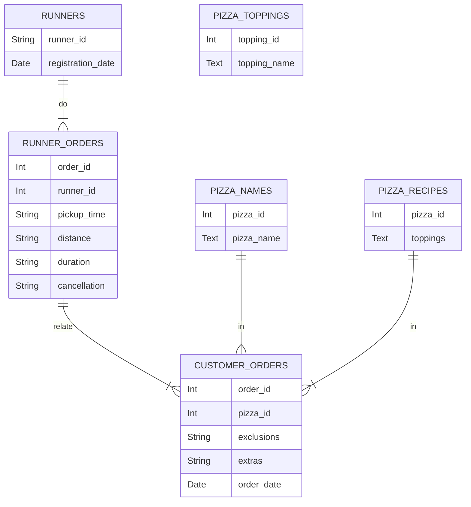

# CASE STUDY #2 - PIZZA RUNNER
## General information
**Case study source:** [Case Study #2 - Pizza Runner](https://8weeksqlchallenge.com/case-study-2/)

**Dataset:** [Here](https://github.com/bokw/8_week_SQL_challenge/blob/main/Case%20study%20%232%20-%20Pizza%20Runner/CS2_data.sql) you can find script with dataset and table creation process using SQLite.

**Problem:** Danny was scrolling through his Instagram feed when something really caught his eye - “80s Retro Styling and Pizza Is The Future!”. He has prepared for us an entity relationship diagram of his database design but requires further assistance to clean his data and apply some basic calculations so he can better direct his runners and optimise Pizza Runner’s operations. 

**Entity relationship diagram:**

The `runners` table shows the `registration_date` for each new runner.

Customer pizza orders are captured in the `customer_orders` table with 1 row for each individual pizza that is part of the order.
The `pizza_id` relates to the type of pizza which was ordered whilst the `exclusions` are the `ingredient_id` values which should be removed from the pizza and the `extras` are the `ingredient_id` values which need to be added to the pizza.
Note that customers can order multiple pizzas in a single order with varying `exclusions` and `extras` values even if the pizza is the same type.

After each orders are received through the system - they are assigned to a runner - however not all orders are fully completed and can be cancelled by the restaurant or the customer. They are written to `runner_orders` table. The `pickup_time` is the timestamp at which the runner arrives at the Pizza Runner headquarters to pick up the freshly cooked pizzas. The `distance` and `duration` fields are related to how far and long the runner had to travel to deliver the order to the respective customer.

Pizza names are stored in the `pizza_names` table.

Pizza recipes are stored in the `pizza_recipes` table.

Pizza toppings are stored in the `pizza_topings` table with their corresponding `topping_id` value.

### Data cleanup
Table `customer_orders` and `runner_orders` had to be cleaned up for further usage. For that reason two new views were created `customer_orders_clean` and `runner_orders_clean`. Code can be viewed [here](https://github.com/bokw/8_week_SQL_challenge/blob/main/Case%20study%20%232%20-%20Pizza%20Runner/CS2_cleanup.sql).

Changes that were done in `customer_orders`:
* Empty strings and 'null' words were changed into proper NULL values.

Changes that were done in `runner_orders`:
* Empty strings and 'null' words were changed into proper NULL values.
* Column `distance` and `duration` were cleaned up to have only numerical values. 

## A. Pizza metrics
### Questions and Solutions
#### 1. How many pizzas were ordered?
```SQL
SELECT 
	COUNT(order_time) AS ordered_pizzas
FROM CS2_customer_orders_clean;
```

#### 2. How many unique customer orders were made?
```SQL
SELECT 
	COUNT(DISTINCT order_id) AS unique_orders
FROM CS2_customer_orders_clean;
```

#### 3. How many successful orders were delivered by each runner?
```SQL
SELECT 
	runner_id 
	,COUNT(DISTINCT order_id) AS unique_delivered_orders
FROM CS2_runner_orders_clean
WHERE pickup_time IS NOT NULL 
GROUP BY runner_id;
```

#### 4. How many of each type of pizza was delivered?
```SQL
SELECT 
	pn.pizza_name 
	,COUNT(coc.order_id) AS delivered_pizza_count
FROM CS2_customer_orders_clean coc
INNER JOIN CS2_runner_orders_clean roc
ON roc.order_id = coc.order_id 
AND roc.cancellation IS NULL
LEFT JOIN CS2_pizza_names pn
ON pn.pizza_id = coc.pizza_id 
GROUP BY 
	pn.pizza_name;
```

#### 5. How many Vegetarian and Meatlovers were ordered by each customer?
```SQL
SELECT
	coc.customer_id 
	,pn.pizza_name 
	,COUNT(coc.order_id) AS delivered_pizza_count
FROM CS2_customer_orders_clean coc
LEFT JOIN CS2_pizza_names pn
ON pn.pizza_id = coc.pizza_id 
GROUP BY 
	coc.customer_id 
	,pn.pizza_name;
```

#### 6. What was the maximum number of pizzas delivered in a single order?
```SQL
SELECT 
	COUNT(order_time) AS max_pizzas_delivered_at_once 
FROM CS2_customer_orders_clean coc
INNER JOIN CS2_runner_orders_clean roc
ON roc.order_id = coc.order_id 
AND roc.cancellation IS NULL
GROUP BY 
	coc.order_id
ORDER BY max_pizzas_delivered_at_once DESC
LIMIT 1;
```

#### 7. For each customer, how many delivered pizzas had at least 1 change and how many had no changes?
```SQL
SELECT
	coc.customer_id 
	,COUNT(CASE 
		WHEN coc.exclusions IS NULL AND coc.extras IS NULL THEN coc.order_time 
	END) AS pizzas_with_no_change
	,COUNT(CASE 
		WHEN coc.exclusions IS NOT NULL OR coc.extras IS NOT NULL THEN coc.order_time 
	END) AS pizzas_with_at_least_one_change
FROM CS2_customer_orders_clean coc
INNER JOIN CS2_runner_orders_clean roc
ON roc.order_id = coc.order_id 
AND roc.cancellation IS NULL
GROUP BY 
	coc.customer_id; 
```

#### 8. How many pizzas were delivered that had both exclusions and extras?
```SQL
SELECT
	COUNT(coc.order_time) AS pizzas_with_exclusions_and_extras
FROM CS2_customer_orders_clean coc
INNER JOIN CS2_runner_orders_clean roc
ON roc.order_id = coc.order_id 
AND roc.cancellation IS NULL
WHERE
	coc.exclusions IS NOT NULL
	AND coc.extras IS NOT NULL;
```

#### 9. What was the total volume of pizzas ordered for each hour of the day?
```SQL
SELECT 
	STRFTIME('%H', order_time) AS order_hour
	,COUNT(coc.order_id) AS order_count
FROM CS2_customer_orders_clean coc
GROUP BY 
	order_hour
ORDER BY 
	order_hour;
```

#### 10. What was the volume of orders for each day of the week?
```SQL
SELECT 
	CASE CAST(STRFTIME('%w', order_time) AS INT)
		WHEN 0 then 'Sunday'
		WHEN 1 then 'Monday'
		WHEN 2 then 'Tuesday'
		WHEN 3 then 'Wednesday'
		WHEN 4 then 'Thursday'
		WHEN 5 then 'Friday'
		WHEN 6 THEN 'Saturday' 
	END AS order_weekday
	,COUNT(coc.order_id) AS order_count
FROM CS2_customer_orders_clean coc
GROUP BY 
	order_weekday
ORDER BY 
	STRFTIME('%w', order_time);
```

