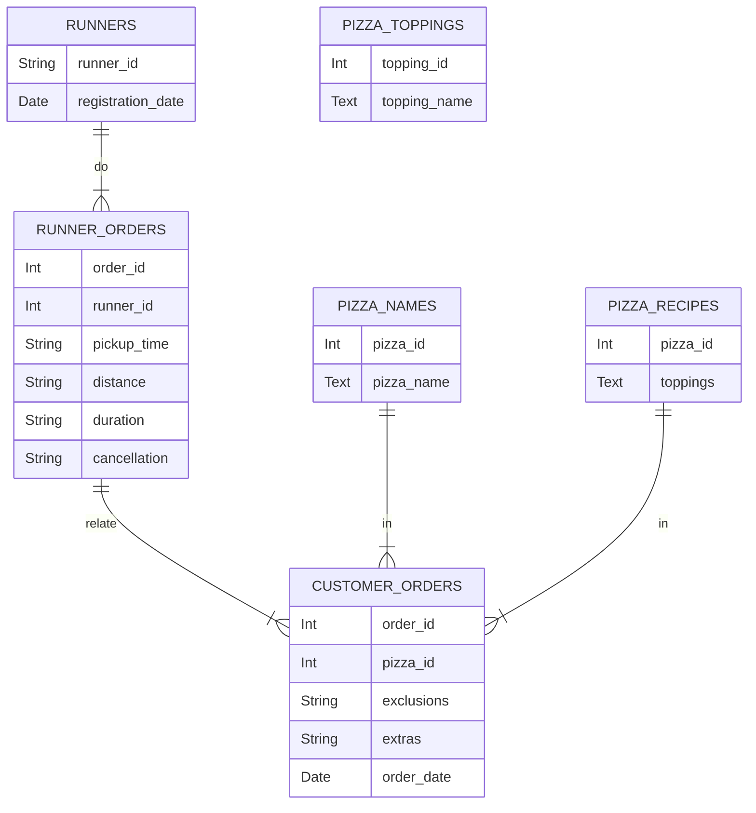

# CASE STUDY #2 - PIZZA RUNNER
## General information
**Case study source:** [Case Study #2 - Pizza Runner](https://8weeksqlchallenge.com/case-study-2/)

**Dataset:** [Here](https://github.com/bokw/8_week_SQL_challenge/blob/main/Case%20study%20%232%20-%20Pizza%20Runner/CS2_data.sql) you can find script with dataset and table creation process using SQLite.

**Problem:** Danny was scrolling through his Instagram feed when something really caught his eye - “80s Retro Styling and Pizza Is The Future!”. He has prepared for us an entity relationship diagram of his database design but requires further assistance to clean his data and apply some basic calculations so he can better direct his runners and optimise Pizza Runner’s operations. 

**Entity relationship diagram:**

The `runners` table shows the `registration_date` for each new runner.

Customer pizza orders are captured in the `customer_orders` table with 1 row for each individual pizza that is part of the order.
The `pizza_id` relates to the type of pizza which was ordered whilst the `exclusions` are the `ingredient_id` values which should be removed from the pizza and the `extras` are the `ingredient_id` values which need to be added to the pizza.
Note that customers can order multiple pizzas in a single order with varying `exclusions` and `extras` values even if the pizza is the same type.

After each orders are received through the system - they are assigned to a runner - however not all orders are fully completed and can be cancelled by the restaurant or the customer. They are written to `runner_orders` table. The `pickup_time` is the timestamp at which the runner arrives at the Pizza Runner headquarters to pick up the freshly cooked pizzas. The `distance` and `duration` fields are related to how far and long the runner had to travel to deliver the order to the respective customer.

Pizza names are stored in the `pizza_names` table.

Pizza recipes are stored in the `pizza_recipes` table.

Pizza toppings are stored in the `pizza_topings` table with their corresponding `topping_id` value.

### Data cleanup
Table `customer_orders` and `runner_orders` had to be cleaned up for further usage. Table `pizza_recipes` had to be restructured. For that reason three new views were created `customer_orders_clean`, `runner_orders_clean` and `pizza_recipes_clean`. Code can be viewed [here](https://github.com/bokw/8_week_SQL_challenge/blob/main/Case%20study%20%232%20-%20Pizza%20Runner/CS2_cleanup.sql).

Changes that were done in `customer_orders`:
* Empty strings and 'null' words were changed into proper NULL values.

Changes that were done in `runner_orders`:
* Empty strings and 'null' words were changed into proper NULL values.
* Column `distance` and `duration` were cleaned up to have only numerical values.

Changes that were done in `pizza_recipes`:
* Each recipe was stored in a string format with each ingredient written after comma. To fix that recipes were split to contain one product per row.

## A. Pizza metrics
### Questions and Solutions
### 1. How many pizzas were ordered?
```SQL
SELECT 
	COUNT(order_time) AS ordered_pizzas
FROM CS2_customer_orders_clean;
```
#### Output
|ordered_pizzas|
|--------------|
|            14|

In total there were 14 pizzas ordered.

### 2. How many unique customer orders were made?
```SQL
SELECT 
	COUNT(DISTINCT order_id) AS unique_orders
FROM CS2_customer_orders_clean;
```
#### Output
|unique_orders|
|-------------|
|           10|

In total there were 10 orders.

### 3. How many successful orders were delivered by each runner?
```SQL
SELECT 
	runner_id 
	,COUNT(DISTINCT order_id) AS unique_delivered_orders
FROM CS2_runner_orders_clean
WHERE pickup_time IS NOT NULL 
GROUP BY runner_id;
```
#### Output
|runner_id|unique_delivered_orders|
|---------|-----------------------|
|        1|                      4|
|        2|                      3|
|        3|                      1|

Runner 1 delivered 4 orders, runner 2 - 3 orders, runner 3 - 1 order.

### 4. How many of each type of pizza was delivered?
```SQL
SELECT 
	pn.pizza_name 
	,COUNT(coc.order_id) AS delivered_pizza_count
FROM CS2_customer_orders_clean coc
INNER JOIN CS2_runner_orders_clean roc
ON roc.order_id = coc.order_id 
AND roc.cancellation IS NULL
LEFT JOIN CS2_pizza_names pn
ON pn.pizza_id = coc.pizza_id 
GROUP BY 
	pn.pizza_name;
```
#### Output
|pizza_name|delivered_pizza_count|
|----------|---------------------|
|Meatlovers|                    9|
|Vegetarian|                    3|

Meatlovers pizza was delivered 9 times, Vegetarian - 3 times.

### 5. How many Vegetarian and Meatlovers were ordered by each customer?
```SQL
SELECT
	coc.customer_id 
	,pn.pizza_name 
	,COUNT(coc.order_id) AS pizzas_ordered
FROM CS2_customer_orders_clean coc
LEFT JOIN CS2_pizza_names pn
ON pn.pizza_id = coc.pizza_id 
GROUP BY 
	coc.customer_id 
	,pn.pizza_name;
```
#### Output
|customer_id|pizza_name|pizzas_ordered|
|-----------|----------|--------------|
|        101|Meatlovers|             2|
|        101|Vegetarian|             1|
|        102|Meatlovers|             2|
|        102|Vegetarian|             1|
|        103|Meatlovers|             3|
|        103|Vegetarian|             1|
|        104|Meatlovers|             3|
|        105|Vegetarian|             1|

Customer 101 and 102 ordered 2 Meatlovers and 1 Vegetarian pizza, customer 103 ordered 3 Meatlovers and 1 Vegetarian, customer 104 ordered 3 Meatlovers and customer 105 ordered only 1 Vegetarian pizza. 

### 6. What was the maximum number of pizzas delivered in a single order?
```SQL
SELECT 
	COUNT(order_time) AS max_pizzas_delivered_at_once 
FROM CS2_customer_orders_clean coc
INNER JOIN CS2_runner_orders_clean roc
ON roc.order_id = coc.order_id 
AND roc.cancellation IS NULL
GROUP BY 
	coc.order_id
ORDER BY max_pizzas_delivered_at_once DESC
LIMIT 1;
```
#### Output
|max_pizzas_delivered_at_once|
|----------------------------|
|                           3|

### 7. For each customer, how many delivered pizzas had at least 1 change and how many had no changes?
```SQL
SELECT
	coc.customer_id 
	,COUNT(CASE 
		WHEN coc.exclusions IS NULL AND coc.extras IS NULL THEN coc.order_time 
	END) AS pizzas_with_no_change
	,COUNT(CASE 
		WHEN coc.exclusions IS NOT NULL OR coc.extras IS NOT NULL THEN coc.order_time 
	END) AS pizzas_with_at_least_one_change
FROM CS2_customer_orders_clean coc
INNER JOIN CS2_runner_orders_clean roc
ON roc.order_id = coc.order_id 
AND roc.cancellation IS NULL
GROUP BY 
	coc.customer_id; 
```
#### Output
|customer_id|pizzas_with_no_change|pizzas_with_at_least_one_change|
|-----------|---------------------|-------------------------------|
|        101|                    2|                              0|
|        102|                    3|                              0|
|        103|                    0|                              3|
|        104|                    1|                              2|
|        105|                    0|                              1|

Customers 101 and 102 had pizzas with no change. Customers 103 and 105 had pizzas with at least one change. Customer 104 had pizzas with and without changes made to them.

### 8. How many pizzas were delivered that had both exclusions and extras?
```SQL
SELECT
	COUNT(coc.order_time) AS pizzas_with_exclusions_and_extras
FROM CS2_customer_orders_clean coc
INNER JOIN CS2_runner_orders_clean roc
ON roc.order_id = coc.order_id 
AND roc.cancellation IS NULL
WHERE
	coc.exclusions IS NOT NULL
	AND coc.extras IS NOT NULL;
```
#### Output
|pizzas_with_exclusions_and_extras|
|---------------------------------|
|                                1|

There was only one pizza that had both - exclusions and extras.

#### 9. What was the total volume of pizzas ordered for each hour of the day?
```SQL
SELECT 
	STRFTIME('%H', order_time) AS order_hour
	,COUNT(coc.order_id) AS order_count
FROM CS2_customer_orders_clean coc
GROUP BY 
	order_hour
ORDER BY 
	order_hour;
```
#### Output
|order_hour|order_count|
|----------|-----------|
|11        |          1|
|13        |          3|
|18        |          3|
|19        |          1|
|21        |          3|
|23        |          3|

At hour 13, 18 and 23 customers put orders for 3 pizzas, at hour 11 and 19 - 1 pizza.

### 10. What was the volume of orders for each day of the week?
```SQL
SELECT 
	CASE CAST(STRFTIME('%w', order_time) AS INT)
		WHEN 0 then 'Sunday'
		WHEN 1 then 'Monday'
		WHEN 2 then 'Tuesday'
		WHEN 3 then 'Wednesday'
		WHEN 4 then 'Thursday'
		WHEN 5 then 'Friday'
		WHEN 6 THEN 'Saturday' 
	END AS order_weekday
	,COUNT(coc.order_id) AS order_count
FROM CS2_customer_orders_clean coc
GROUP BY 
	order_weekday
ORDER BY 
	STRFTIME('%w', order_time);
```
#### Output
|order_weekday|order_count|
|-------------|-----------|
|Wednesday    |          5|
|Thursday     |          3|
|Friday       |          1|
|Saturday     |          5|

Monday, Tuesday and Sunday had no pizza orders. Wednesday and Saturday were the most active - with 5 pizzas each, Thursday - 3 pizzas, Friday - 1 pizza.

## B. Runner and customer experience
### Questions and Solutions
### 1. How many runners signed up for each 1 week period? (i.e. week starts 2021-01-01)
```SQL
SELECT 
	'Week ' || STRFTIME('%W', registration_date) AS week
	,COUNT(runner_id) AS runner_count
FROM CS2_runners 
GROUP BY
	STRFTIME('%W', registration_date)
ORDER BY week;
```
#### Output
|week   |runner_count|
|-------|------------|
|Week 00|           2|
|Week 01|           1|
|Week 02|           1|

**Note:** We have 'Week 00' due to how SQLite calculates weeks. If week is a part of last years week it gets counted as zero week.

For first week there were 2 signees. For two following weeks - one per week.

### 2. What was the average time in minutes it took for each runner to arrive at the Pizza Runner HQ to pickup the order?
```SQL
WITH order_time AS (
	SELECT DISTINCT
		roc.order_id 
		,roc.runner_id 
		,roc.pickup_time 
		,coc.order_time 
	FROM CS2_runner_orders_clean roc
	INNER JOIN CS2_customer_orders_clean coc 
	ON coc.order_id = roc.order_id
	WHERE roc.pickup_time IS NOT NULL
)

SELECT 
	runner_id
	,ROUND(AVG(CAST((JULIANDAY(pickup_time) - JULIANDAY(order_time)) * 24 * 60 AS REAL)), 0) AS average_time_order_to_pickup_min
FROM order_time
GROUP BY 
	runner_id;
```
#### Output
|runner_id|average_time_order_to_pickup_min|
|---------|--------------------------------|
|        1|                            14.0|
|        2|                            20.0|
|        3|                            10.0|

Runner 3 was the fastest taking only 10 minutes, runner 1 - 14 minutes and runner 2 took the longest - 20 minutes.

### 3. Is there any relationship between the number of pizzas and how long the order takes to prepare?
```SQL
WITH orders_table AS (
	SELECT DISTINCT 
		coc.order_id
		,COUNT(coc.pizza_id) AS pizzas_per_order
		,ROUND(CAST((JULIANDAY(pickup_time) - JULIANDAY(order_time)) * 24 * 60 AS REAL), 0) AS order_to_pickup
	FROM CS2_customer_orders_clean coc 
	INNER JOIN CS2_runner_orders_clean roc 
	ON roc.order_id = coc.order_id
	WHERE roc.pickup_time IS NOT NULL
	GROUP BY coc.order_id
)

SELECT
	pizzas_per_order
	,COUNT(order_id) AS order_count
	,ROUND(AVG(order_to_pickup), 0) AS average_order_to_pickup
	,ROUND(order_to_pickup / pizzas_per_order, 0) AS average_time_per_pizza
FROM orders_table
GROUP BY pizzas_per_order;
```
#### Output
|pizzas_per_order|order_count|average_order_to_pickup|average_time_per_pizza|
|----------------|-----------|-----------------------|----------------------|
|               1|          5|                   12.0|                  11.0|
|               2|          2|                   19.0|                  11.0|
|               3|          1|                   29.0|                  10.0|

The more pizzas per order there is the faster order is ready to pick up. For order with three pizzas it takes 10 minutes per pizza.

#### 4. What was the average distance travelled for each customer?
```SQL
SELECT DISTINCT 
	coc.customer_id  
	,ROUND(AVG(roc.distance_km), 2) AS average_distance
FROM CS2_customer_orders_clean coc 
INNER JOIN CS2_runner_orders_clean roc 
ON roc.order_id = coc.order_id
WHERE roc.pickup_time IS NOT NULL
GROUP BY coc.customer_id;
```
#### Output
|customer_id|average_distance|
|-----------|----------------|
|        101|            20.0|
|        102|           16.73|
|        103|            23.4|
|        104|            10.0|
|        105|            25.0|

Average distance travelled for customer 101 was 20 km, 102 - 16.73 km, 103 - 23.4 km, 104 - 10 km and 105 - 25 km.

### 5. What was the difference between the longest and shortest delivery times for all orders?
```SQL
WITH orders_table AS (
	SELECT DISTINCT 
		coc.order_id
		,ROUND(CAST((JULIANDAY(pickup_time) - JULIANDAY(order_time)) * 24 * 60 AS REAL), 0) AS order_to_pickup
	FROM CS2_customer_orders_clean coc 
	INNER JOIN CS2_runner_orders_clean roc 
	ON roc.order_id = coc.order_id
	WHERE roc.pickup_time IS NOT NULL
	GROUP BY coc.order_id
)

SELECT 
	MAX(order_to_pickup) - MIN(order_to_pickup) AS diff_min_and_max_delivery_time
FROM orders_table;
```
#### Output
|diff_min_and_max_delivery_time|
|------------------------------|
|                          19.0|

Difference between maximum and minumum delivery time was 19 minutes.

### 6. What was the average speed for each runner for each delivery and do you notice any trend for these values?
```SQL
SELECT 
	roc.order_id 
	,roc.runner_id 
	,roc.distance_km 
	,ROUND(roc.distance_km  / (roc.duration_min / 60.0), 1) AS average_speed_km_h
FROM CS2_runner_orders_clean roc 
WHERE roc.pickup_time IS NOT NULL
ORDER BY runner_id, average_speed_km_h;
```
#### Output
|order_id|runner_id|distance_km|average_speed_km_h|
|--------|---------|-----------|------------------|
|       1|        1|       20.0|              37.5|
|       3|        1|       13.4|              40.2|
|       2|        1|       20.0|              44.4|
|      10|        1|       10.0|              60.0|
|       4|        2|       23.4|              35.1|
|       7|        2|       25.0|              60.0|
|       8|        2|       23.4|              93.6|
|       5|        3|         10|              40.0|

Runner 1 had speeds between 37.5 km/h and 60 km/h, runner 2 - between 35.1 km/h and 93.6 km/h, runner 3 had only one order that took him 40 km/h.

### 7. What is the successful delivery percentage for each runner?
```SQL
SELECT 
	roc.runner_id 
	,COUNT(CASE WHEN roc.cancellation IS NULL THEN roc.order_id END) * 100.0 / COUNT(roc.order_id) AS successful_delivery_rate
FROM CS2_runner_orders_clean roc 
GROUP BY 
	roc.runner_id;
```
#### Output
|runner_id|successful_delivery_rate|
|---------|------------------------|
|        1|                   100.0|
|        2|                    75.0|
|        3|                    50.0|

Runner 1 had 100% successful delivery rate, runner 2 - 75%, runner 3 - 50%.

## C. Ingredient optimisation
### Questions and Solutions
### 1. What are the standard ingredients for each pizza?
```SQL
SELECT 
	topping_name
	,pizzas_with_topping
FROM 
	(
	SELECT 
		pt.topping_name
		,COUNT(DISTINCT pr.pizza_id) AS pizzas_with_topping
		,DENSE_RANK() OVER (ORDER BY COUNT(DISTINCT pr.pizza_id) DESC) AS ranking
	FROM CS2_pizza_recipes_clean pr
	LEFT JOIN CS2_pizza_toppings pt
	ON pt.topping_id = pr.topping
	GROUP BY pt.topping_name
	)
WHERE ranking = 1;
```
#### Output
|topping_name|pizzas_with_topping|
|------------|-------------------|
|Mushrooms   |                  2|
|Cheese      |                  2|

Toppings that are standard ingrediedent in both pizzas are mushrooms and cheese.

### 2. What was the most commonly added extra?
```SQL
WITH RECURSIVE split(extra, string) AS (
	SELECT 
		NULL
		,extras||','
	FROM CS2_customer_orders_clean
	UNION ALL
	SELECT 
		TRIM(SUBSTR(string, 0, INSTR(string, ',')), ' ')
		,SUBSTR(string, INSTR(string, ',') + 1) 
	FROM split 
	WHERE 
		string <> ''
)
SELECT 
	topping_name
	,count_extra
FROM
	(
	SELECT
		CAST(s.extra AS INT) AS extra
		,pt.topping_name 
		,COUNT(s.extra) AS count_extra
		,DENSE_RANK() OVER (ORDER BY COUNT(s.extra) DESC) AS ranking
	FROM split s
	LEFT JOIN CS2_pizza_toppings pt
	ON pt.topping_id = s.extra
	WHERE 
		s.extra <> ''
	GROUP BY 
		s.extra
	)
WHERE ranking = 1;
```
#### Output
|topping_name|count_extra|
|------------|-----------|
|Bacon       |          4|

The most commonly added extra was bacon, extra was requested 4 times in total.

### 3. What was the most common exclusion?
```SQL
WITH RECURSIVE split(exclusion, string) AS (
	SELECT 
		NULL
		,exclusions||','
	FROM CS2_customer_orders_clean
	UNION ALL
	SELECT 
		TRIM(SUBSTR(string, 0, INSTR(string, ',')), ' ')
		,SUBSTR(string, INSTR(string, ',') + 1) 
	FROM split 
	WHERE 
		string <> ''
)
SELECT 
	topping_name
	,count_exclusion
FROM
	(
	SELECT
		CAST(s.exclusion AS INT) AS exclusion
		,pt.topping_name 
		,COUNT(s.exclusion) AS count_exclusion
		,DENSE_RANK() OVER (ORDER BY COUNT(s.exclusion) DESC) AS ranking
	FROM split s
	LEFT JOIN CS2_pizza_toppings pt
	ON pt.topping_id = s.exclusion
	WHERE 
		s.exclusion <> ''
	GROUP BY 
		s.exclusion
	)
WHERE ranking = 1;
```
#### Output
|topping_name|count_exclusion|
|------------|---------------|
|Cheese      |              4|

The most commonly removed topping was cheese, it was requested to be removed 4 times in total.

### 4. Generate an order item for each record in the customers_orders table in the format of one of the following:
|description							|
|---------------------------------------------------------------|
|Meat Lovers							|
|Meat Lovers - Exclude Beef					|
|Meat Lovers - Extra Bacon					|
|Meat Lovers - Exclude Cheese, Bacon - Extra Mushroom, Peppers	|
```SQL
WITH RECURSIVE 
	split_ext(id, order_id, pizza_id, extras, extra, string) AS (
		SELECT
			ROW_NUMBER() OVER (PARTITION BY order_id ORDER BY order_id, pizza_id, exclusions, extras ASC) AS id
			,order_id
			,pizza_id
			,extras
			,NULL
			,extras||','
		FROM CS2_customer_orders_clean
		UNION ALL
		SELECT
			id
			,order_id
			,pizza_id
			,extras	
			,TRIM(SUBSTR(string, 0, INSTR(string, ',')), ' ')
			,SUBSTR(string, INSTR(string, ',') + 1) 
		FROM split_ext
		WHERE 
			string <> ''
	),
	split_exc(id, order_id, pizza_id, exclusions, exclusion, string) AS (
		SELECT
			ROW_NUMBER() OVER (PARTITION BY order_id ORDER BY order_id, pizza_id, exclusions, extras ASC) AS id
			,order_id
			,pizza_id
			,exclusions
			,NULL
			,exclusions||','
		FROM CS2_customer_orders_clean
		UNION ALL
		SELECT
			id
			,order_id
			,pizza_id
			,exclusions
			,TRIM(SUBSTR(string, 0, INSTR(string, ',')), ' ')
			,SUBSTR(string, INSTR(string, ',') + 1) 
		FROM split_exc
		WHERE 
			string <> ''
	)
SELECT 
	final_table.order_id
	,final_table.id AS pizza_in_order
	,final_table.pizza_name||GROUP_CONCAT(final_table.descr, '') AS description
FROM 
	(
	SELECT
		split.order_id
		,split.id 
		,split.pizza_id
		,CASE 
			WHEN pn.pizza_name = 'Meatlovers' THEN 'Meat Lovers' ELSE pn.pizza_name
		END AS pizza_name
		,extra_or_exclusion
		,pt.topping_name
		,CASE 
			WHEN pt.topping_name IS NOT NULL AND split.extra_or_exclusion = 'extra' THEN ' - Extra '||GROUP_CONCAT(pt.topping_name, ', ')
			WHEN pt.topping_name IS NOT NULL AND split.extra_or_exclusion = 'exclusion' THEN ' - Exclude '||GROUP_CONCAT(pt.topping_name, ', ') 
			ELSE ''
		END AS descr
	FROM 
		(
		SELECT 
			order_id
			,id
			,pizza_id
			,'extra' AS extra_or_exclusion
			,extra AS topping
		FROM split_ext 
		WHERE extra IS NOT NULL 
		UNION ALL
		SELECT 
			order_id
			,id 
			,pizza_id 
			,'extra' AS extra_or_exclusion
			,extra AS topping
		FROM split_ext
		WHERE topping IS NULL AND NOT EXISTS (
			SELECT 1 FROM split_ext se_B
			WHERE se_B.order_id = split_ext.order_id AND se_B.id = split_ext.id AND se_B.pizza_id = split_ext.pizza_id AND se_B.extra IS NOT NULL
			)
		UNION ALL 
		SELECT 
			order_id
			,id
			,pizza_id
			,'exclusion' AS extra_or_exclusion
			,exclusion AS topping
		FROM split_exc 
		WHERE exclusion IS NOT NULL 
		UNION ALL
		SELECT 
			order_id
			,id 
			,pizza_id 
			,'exclusion' AS extra_or_exclusion
			,exclusion AS topping
		FROM split_exc
		WHERE topping IS NULL AND NOT EXISTS (
			SELECT 1 FROM split_exc se_B
			WHERE se_B.order_id = split_exc.order_id AND se_B.id = split_exc.id AND se_B.pizza_id = split_exc.pizza_id AND se_B.exclusion IS NOT NULL
			)
		) split
	LEFT JOIN CS2_pizza_names pn 
	ON pn.pizza_id = split.pizza_id
	LEFT JOIN CS2_pizza_toppings pt
	ON pt.topping_id = split.topping
	GROUP BY 
		split.order_id
		,split.id
		,split.pizza_id
		,split.extra_or_exclusion
	ORDER BY 
		split.order_id
		,split.id
		,pn.pizza_id
		,split.extra_or_exclusion
		,split.topping
	) final_table
GROUP BY 
	final_table.order_id
	,final_table.pizza_id
	,final_table.id
ORDER BY order_id;
```
#### Output
|order_id|pizza_in_order|description                                                     |
|--------|--------------|----------------------------------------------------------------|
|       1|             1|Meat Lovers                                                     |
|       2|             1|Meat Lovers                                                     |
|       3|             1|Meat Lovers                                                     |
|       3|             2|Vegetarian                                                      |
|       4|             1|Meat Lovers - Exclude Cheese                                    |
|       4|             2|Meat Lovers - Exclude Cheese                                    |
|       4|             3|Vegetarian - Exclude Cheese                                     |
|       5|             1|Meat Lovers - Extra Bacon                                       |
|       6|             1|Vegetarian                                                      |
|       7|             1|Vegetarian - Extra Bacon                                        |
|       8|             1|Meat Lovers                                                     |
|       9|             1|Meat Lovers - Exclude Cheese - Extra Bacon, Chicken             |
|      10|             1|Meat Lovers                                                     |
|      10|             2|Meat Lovers - Exclude BBQ Sauce, Mushrooms - Extra Bacon, Cheese|
      
### 5. Generate an alphabetically ordered comma separated ingredient list for each pizza order from the customer_orders table and add a 2x in front of any relevant ingredients. For example: "Meat Lovers: 2xBacon, Beef, ... , Salami".
```SQL
WITH RECURSIVE 
	split_ext(id, order_id, pizza_id, extras, extra, string) AS (
		SELECT
			ROW_NUMBER() OVER (PARTITION BY order_id ORDER BY order_id, pizza_id, exclusions, extras ASC) AS id
			,order_id
			,pizza_id
			,extras
			,NULL
			,extras||','
		FROM CS2_customer_orders_clean
		UNION ALL
		SELECT
			id
			,order_id
			,pizza_id
			,extras	
			,TRIM(SUBSTR(string, 0, INSTR(string, ',')), ' ')
			,SUBSTR(string, INSTR(string, ',') + 1) 
		FROM split_ext
		WHERE 
			string <> ''
	),
	split_exc(id, order_id, pizza_id, exclusions, exclusion, string) AS (
		SELECT
			ROW_NUMBER() OVER (PARTITION BY order_id ORDER BY order_id, pizza_id, exclusions, extras ASC) AS id
			,order_id
			,pizza_id
			,exclusions
			,NULL
			,exclusions||','
		FROM CS2_customer_orders_clean
		UNION ALL
		SELECT
			id
			,order_id
			,pizza_id
			,exclusions
			,TRIM(SUBSTR(string, 0, INSTR(string, ',')), ' ')
			,SUBSTR(string, INSTR(string, ',') + 1) 
		FROM split_exc
		WHERE 
			string <> ''
	)
SELECT
	final_table.order_id
	,final_table.id AS pizza_in_order
	,final_table.pizza_name||': '||GROUP_CONCAT(final_table.end_recipe, ', ') AS recipe
FROM
	(
	SELECT 
		recipe.order_id
		,recipe.id
		,CASE WHEN pn.pizza_name = 'Meatlovers' THEN 'Meat Lovers' ELSE pn.pizza_name END AS pizza_name
		,CASE WHEN COUNT(pt.topping_name) = 1 THEN '' ELSE COUNT(pt.topping_name)||'x ' END || pt.topping_name AS end_recipe
	FROM
		(	
		SELECT 
			order_id
			,id
			,pizza_id
			,'extra' AS status
			,extra AS topping
		FROM split_ext 
		WHERE extra IS NOT NULL 
		UNION ALL
		SELECT 
			order_id
			,id 
			,pizza_id 
			,'extra' AS status
			,extra AS topping
		FROM split_ext
		WHERE topping IS NULL AND NOT EXISTS (
			SELECT 1 FROM split_ext se_B
			WHERE se_B.order_id = split_ext.order_id AND se_B.id = split_ext.id AND se_B.pizza_id = split_ext.pizza_id AND se_B.extra IS NOT NULL
			)
		UNION ALL
		SELECT 
			coc.order_id 
			,coc.id
			,coc.pizza_id 
			,'recipe' AS status
			,prc.topping 
		FROM CS2_customer_orders_clean coc 
		LEFT JOIN CS2_pizza_recipes_clean prc 
		ON prc.pizza_id = coc.pizza_id 
		ORDER BY coc.order_id 
		) recipe
	LEFT OUTER JOIN split_exc se
	ON se.id = recipe.id
	AND se.order_id = recipe.order_id 
	AND se.exclusion = recipe.topping
	AND se.exclusion IS NULL
	LEFT JOIN CS2_pizza_names pn
	ON pn.pizza_id = recipe.pizza_id
	LEFT JOIN CS2_pizza_toppings pt
	ON pt.topping_id = recipe.topping
	WHERE recipe.topping IS NOT NULL
	GROUP BY 
		recipe.order_id
		,recipe.id
		,pn.pizza_name
		,pt.topping_name
	) final_table
GROUP BY 
	final_table.order_id
	,final_table.id;
```
#### Output
|order_id|pizza_in_order|recipe                                                                                  |
|--------|--------------|----------------------------------------------------------------------------------------|
|       1|             1|Meat Lovers: BBQ Sauce, Bacon, Beef, Cheese, Chicken, Mushrooms, Pepperoni, Salami      |
|       2|             1|Meat Lovers: BBQ Sauce, Bacon, Beef, Cheese, Chicken, Mushrooms, Pepperoni, Salami      |
|       3|             1|Meat Lovers: BBQ Sauce, Bacon, Beef, Cheese, Chicken, Mushrooms, Pepperoni, Salami      |
|       3|             2|Vegetarian: Cheese, Mushrooms, Onions, Peppers, Tomato Sauce, Tomatoes                  |
|       4|             1|Meat Lovers: BBQ Sauce, Bacon, Beef, Cheese, Chicken, Mushrooms, Pepperoni, Salami      |
|       4|             2|Meat Lovers: BBQ Sauce, Bacon, Beef, Cheese, Chicken, Mushrooms, Pepperoni, Salami      |
|       4|             3|Vegetarian: Cheese, Mushrooms, Onions, Peppers, Tomato Sauce, Tomatoes                  |
|       5|             1|Meat Lovers: BBQ Sauce, 2x Bacon, Beef, Cheese, Chicken, Mushrooms, Pepperoni, Salami   |
|       6|             1|Vegetarian: Cheese, Mushrooms, Onions, Peppers, Tomato Sauce, Tomatoes                  |
|       7|             1|Vegetarian: Bacon, Cheese, Mushrooms, Onions, Peppers, Tomato Sauce, Tomatoes           |
|       8|             1|Meat Lovers: BBQ Sauce, Bacon, Beef, Cheese, Chicken, Mushrooms, Pepperoni, Salami      |
|       9|             1|Meat Lovers: BBQ Sauce, 2x Bacon, Beef, Cheese, 2x Chicken, Mushrooms, Pepperoni, Salami|
|      10|             1|Meat Lovers: BBQ Sauce, Bacon, Beef, Cheese, Chicken, Mushrooms, Pepperoni, Salami      |
|      10|             2|Meat Lovers: BBQ Sauce, 2x Bacon, Beef, 2x Cheese, Chicken, Mushrooms, Pepperoni, Salami|

#### 6. What is the total quantity of each ingredient used in all delivered pizzas sorted by most frequent first?
```SQL
WITH RECURSIVE 
	split_ext(id, order_id, pizza_id, extras, extra, string) AS (
		SELECT
			ROW_NUMBER() OVER (PARTITION BY order_id ORDER BY order_id, pizza_id, exclusions, extras ASC) AS id
			,order_id
			,pizza_id
			,extras
			,NULL
			,extras||','
		FROM CS2_customer_orders_clean
		UNION ALL
		SELECT
			id
			,order_id
			,pizza_id
			,extras	
			,TRIM(SUBSTR(string, 0, INSTR(string, ',')), ' ')
			,SUBSTR(string, INSTR(string, ',') + 1) 
		FROM split_ext
		WHERE 
			string <> ''
	),
	split_exc(id, order_id, pizza_id, exclusions, exclusion, string) AS (
		SELECT
			ROW_NUMBER() OVER (PARTITION BY order_id ORDER BY order_id, pizza_id, exclusions, extras ASC) AS id
			,order_id
			,pizza_id
			,exclusions
			,NULL
			,exclusions||','
		FROM CS2_customer_orders_clean
		UNION ALL
		SELECT
			id
			,order_id
			,pizza_id
			,exclusions
			,TRIM(SUBSTR(string, 0, INSTR(string, ',')), ' ')
			,SUBSTR(string, INSTR(string, ',') + 1) 
		FROM split_exc
		WHERE 
			string <> ''
	)
SELECT 
	pt.topping_name
	,COUNT(pt.topping_name) AS times_needed
FROM
	(	
	SELECT 
		order_id
		,id
		,pizza_id
		,'extra' AS status
		,extra AS topping
	FROM split_ext 
	WHERE extra IS NOT NULL 
	UNION ALL
	SELECT 
		order_id
		,id 
		,pizza_id 
		,'extra' AS status
		,extra AS topping
	FROM split_ext
	WHERE topping IS NULL AND NOT EXISTS (
		SELECT 1 FROM split_ext se_B
		WHERE se_B.order_id = split_ext.order_id AND se_B.id = split_ext.id AND se_B.pizza_id = split_ext.pizza_id AND se_B.extra IS NOT NULL
		)
	UNION ALL
	SELECT 
		coc.order_id 
		,coc.id
		,coc.pizza_id 
		,'recipe' AS status
		,prc.topping 
	FROM CS2_customer_orders_clean coc 
	LEFT JOIN CS2_pizza_recipes_clean prc 
	ON prc.pizza_id = coc.pizza_id 
	ORDER BY coc.order_id 
	) recipe
LEFT OUTER JOIN split_exc se
ON se.id = recipe.id
AND se.order_id = recipe.order_id 
AND se.exclusion = recipe.topping
AND se.exclusion IS NULL
LEFT JOIN CS2_pizza_toppings pt
ON pt.topping_id = recipe.topping
WHERE recipe.topping IS NOT NULL
GROUP BY 
	pt.topping_name
ORDER BY 
	times_needed DESC;
```
#### Output
|topping_name|times_needed|
|------------|------------|
|Cheese      |          15|
|Mushrooms   |          14|
|Bacon       |          14|
|Chicken     |          11|
|Salami      |          10|
|Pepperoni   |          10|
|Beef        |          10|
|BBQ Sauce   |          10|
|Tomatoes    |           4|
|Tomato Sauce|           4|
|Peppers     |           4|
|Onions      |           4|

The most often needed ingredient was cheese (15 times) follwed by mushrooms and bacon (14 times each).
