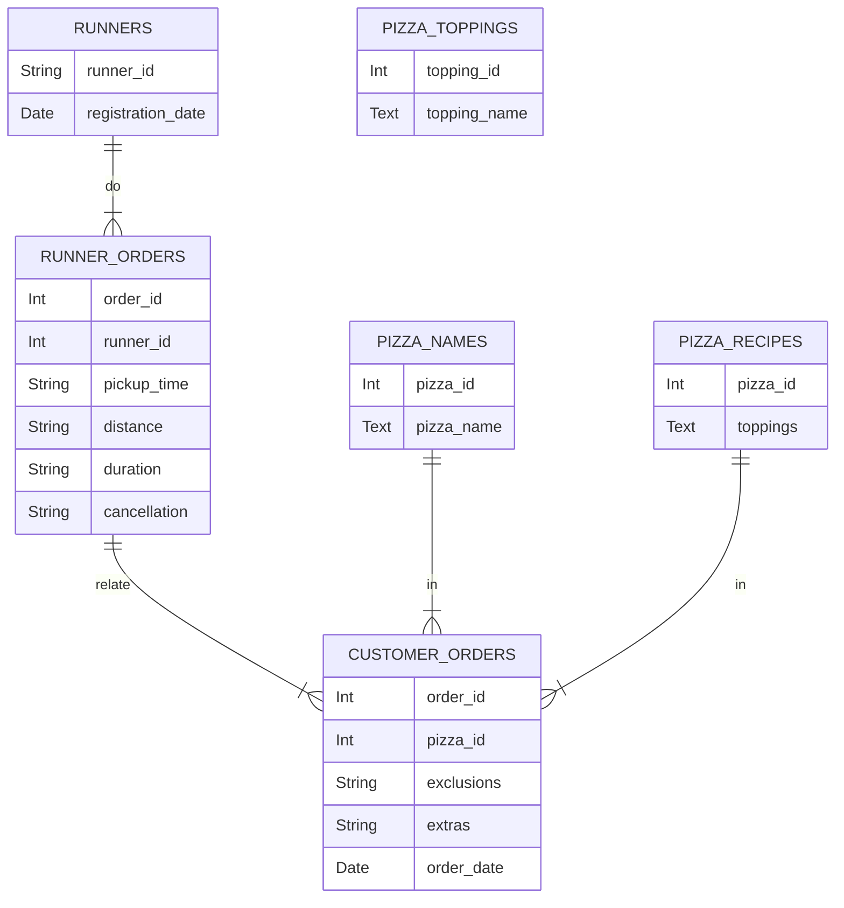

# CASE STUDY #2 - PIZZA RUNNER
## General information
**Case study source:** [Case Study #2 - Pizza Runner](https://8weeksqlchallenge.com/case-study-2/)

**Dataset:** [Here]() you can find script with dataset and table creation process using SQLite.

**Problem:** Danny was scrolling through his Instagram feed when something really caught his eye - “80s Retro Styling and Pizza Is The Future!”. He has prepared for us an entity relationship diagram of his database design but requires further assistance to clean his data and apply some basic calculations so he can better direct his runners and optimise Pizza Runner’s operations. 

**Entity relationship diagram:**

The `runners` table shows the `registration_date` for each new runner.

Customer pizza orders are captured in the `customer_orders` table with 1 row for each individual pizza that is part of the order.
The `pizza_id` relates to the type of pizza which was ordered whilst the `exclusions` are the `ingredient_id` values which should be removed from the pizza and the `extras` are the `ingredient_id` values which need to be added to the pizza.
Note that customers can order multiple pizzas in a single order with varying `exclusions` and `extras` values even if the pizza is the same type.

After each orders are received through the system - they are assigned to a runner - however not all orders are fully completed and can be cancelled by the restaurant or the customer. They are written to `runner_orders` table. The `pickup_time` is the timestamp at which the runner arrives at the Pizza Runner headquarters to pick up the freshly cooked pizzas. The `distance` and `duration` fields are related to how far and long the runner had to travel to deliver the order to the respective customer.

Pizza names are stored in the `pizza_names` table.

Pizza recipes are stored in the `pizza_recipes` table.

Pizza toppings are stored in the `pizza_topings` table with their corresponding `topping_id` value.

## A. Pizza metrics
## Questions and Solutions
### 1. 
